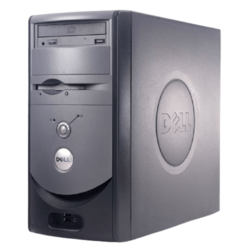
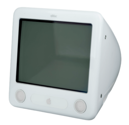
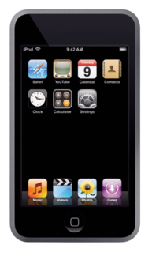

## Foreword
I have always had a great appreciation for beautiful design (specifically in the digital world).

This appreciation has only become more prominent in the last couple years as I dove headfirst into the world of web development. With this website as my sort of "lab", I've been able to experiment with different UI elements, colour schemes, design languages, and more.

But all of these experiments in design must have been drawing inspiration from somewhere, right?

In this post, I'm analyzing my own sense of design and what has inspired it at different points in my life.

## Early OS Experience
The basis for my interest in anything digital, including digital design, stems from my lifelong love of computers. For me, growing up in the age of the GUI meant that I could quickly learn how to use a computer with relative ease (relative to using a CLI, which I didn't learn until university).

I always enjoyed using computers and learning how to navigate their operating systems. From my family's old Dell Dimension running Windows XP, that I used to use for Club Penguin

to the eMac desktops that we used in my school's computer lab,

I loved learning how to do new things on any system I could get my hands on.

This meant learning how to efficiently navigate two very different operating systems, and in my efforts to master them, I got to know their different design languages in a deep way.

I saw Windows XP as much less modern looking. I guess, in comparison, the eMac's OS X Puma *did* have a much more modern look. Apple always has and still does strive to look like they're "ahead of the curve".

Although I was fascinated by the different ways the two operating systems were made to be easy to navigate, I loved the colours, fonts, rounded window corners, use of transparency, and just the general feel of Apple's OS way more than Microsoft's.

This started a great appreciating of Apple's design in my mind.

## Think [and Design] Different
I'm not sure exactly when it happened, but I started being known as a real "Apple guy".

I begged my mom for a first generation iPod Nano, and I brought that thing with me *everywhere* I went. I was always up on Apple's latest products, knowing not only the ins and outs of their hardware and software designs, but also their feature sets. It even got to a point that, shortly after the launch of the iPhone in 2007, I joined a Genius at the Apple Store Yorkdale to give an "Intro to iPhone" talk, covering its revolutionary features and selling points to a group of prospecting buyers.

Although I adored the genius design behind the click wheel on OG iPods, it was the touch-centric OS on my first generation iPod Touch that really cemented my love for Apple's design. With sleek, rounded icons, a reflective dock, and consistent UI design throughout, Apple's first [(technically second)](https://en.wikipedia.org/wiki/Apple_Newton) touch device was a true winner in my eyes.

My Apple love only continued from there, with my first computer - a 2010 polycarbonate MacBook - showing me how much the Mac operating system had evolved since Puma, to become the beloved Snow Leopard. I can still hear that [surreal OS welcome music](https://www.youtube.com/watch?v=FPTp-YInbJ0)... damn.

Everything about Apple's design (software, mainly) spoke to me and still does in many ways, to this day.

