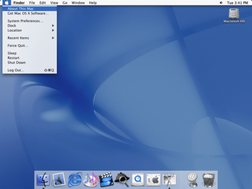
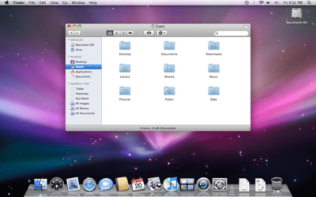

## Foreword
Hey there! It's been a while. I'm all finished with my degree and ready to get some blog posts out!

I have always had a great appreciation for beautiful design (specifically in the digital world).

This appreciation has only become more prominent in the last couple years with my head-first dive into the world of web development. With this website as my sort of "lab", I've been able to experiment with different UI elements, colour schemes, design languages, and more.

But all of these experiments in design must have been drawing inspiration from somewhere, right?

In this post, I'm analyzing my own sense of design, the things that have contribute to it, and some of my frequently used design elements.
## Early OS Experience
The basis for my interest in anything digital, including digital design, stems from my lifelong love of computers. For me, growing up in the age of the GUI meant that I could quickly learn how to use a computer with relative ease (relative to using a CLI, which I didn't learn until university).

I always enjoyed using computers and learning how to navigate their operating systems. From my family's old Dell Dimension running Windows XP, that I used to use for Club Penguin

to the eMac desktops that we used in my school's computer lab,

I loved learning how to do new things on any system I could get my hands on.

This meant learning how to efficiently navigate two very different operating systems, and in my efforts to master them, I got to know their different design languages in a deep way.

I saw Windows XP as much less modern looking. I guess, in comparison, the eMac's OS X Puma *did* have a much more modern look. Apple always has and still does strive to look like they're "ahead of the curve".

Although I was fascinated by the different ways the two operating systems were made to be easy to navigate, I loved the colours, fonts, rounded window corners, use of transparency, and just the general feel of Apple's desktop OS way more than Microsoft's.

This started a great appreciating of Apple's design in my mind.

## Think [and Design] Different
I'm not sure exactly when it happened, but I started being known as a real "Apple guy".

I begged my mom for a first generation iPod Nano, and I brought that thing with me *everywhere* I went. I was always up on Apple's latest products, knowing not only the feature sets of their devices, but also the ins and outs of their hardware and software designs. It even got to a point that shortly after the launch of the iPhone in 2007, I joined a Genius at the Yorkdale Apple Store to help give an "Intro to iPhone" talk, covering its revolutionary features and selling points to a group of prospecting buyers.

Although I adored the beautifully simple design behind the click wheel on OG iPods, it was the touch-centric OS on my first generation iPod Touch that really cemented my love for Apple's design. With sleek, rounded icons, a reflective dock, and consistent UI design throughout, Apple's first [(technically second)](https://en.wikipedia.org/wiki/Apple_Newton) touch device was a true winner in my eyes.

My Apple love only continued from there, with my first computer - a 2010 polycarbonate MacBook - showing me how much the Mac operating system had evolved since Puma, to become the beloved Snow Leopard. I can still hear that [surreal OS welcome music](https://www.youtube.com/watch?v=FPTp-YInbJ0)... damn.

Everything about Apple's design (software, mainly) spoke to me and still does in many ways, to this day.

## Specific Design Elements
Let's take a look at some of the specific elements in a UI that I've taken a liking to, and use pretty consistently throughout my software design.
### Rounded Corners
I really, really like rounded corners. Although, technically speaking, they are an waste of space in a UI, I just think they make software so much easier to use. Same goes for hardware, to be honest - things with rounded corners are just more appealing to me.

[Apple is no stranger to using rounded boxes](https://www.youtube.com/watch?v=bxgg_kW3QLU) in both their software *and* hardware design, so it's no surprise that I've taken such a liking to the use of rounded corners in software and web design.

My use of the CSS `border-radius` property can certainly be seen throughout this site. I just feel that, especially when there's no need to pack many things into a tight UI, using rounded corners just makes things easier on the eyes and less threatening.

### Darker Colours (by Choice)
With dark mode on the rise in software these past few years, I've hopped onto the trend wherever I can, with my OS appearance preference across all devices being to enable dark more.

While designing this website, I kept that in mind, using dark colours for the initial version of the site. It wasn't until my recent implementation of a theme switcher (currently the memoji gif at the top of the page) that I decided to create a *light* mode for the site.

Personally, I still prefer the dark theme.

### Grid-based Layouts
This is a design element that I've taken to more recently than the previously mentioned one, but is one I pretty much keep in mind at the start of developing any UI.

I find that grids are just the best way to display data pooled into different sections, with those sections containing many repeating things or attributes. Take, for example, my use of CSS grid to not only create the overall layout of this site, but also the inner sections for experience and projects. CSS grid is an awesome tool and definitely worth learning (it's not hard).

### Simple and Light Fonts
This site's main font is [Inter](https://fonts.google.com/specimen/Inter) - a free font provided by Google Fonts. It's awesome, simple, sans-serif, and light.

I like these types of fonts. They're easy to read, aesthetically pleasing, and can be used for anything from headers to paragraphs.

Another font I've always loved and use in documents more often is Helvetica Neue Light.

### Hover Transitions
In my pursuit of good UI/UX design practices, this one has recently become a big focus for me.

I find that with any website, such as this one, if something is supposed to be clicked, it should really be indicated to the user when a cursor hovers over it - whether accidentally or intentionally.

This is why you'll find transitions applied to borders, scale, and cursor type for most or all clickable elements on this site. Any of the experience, project, blog post, or education items use the same transitions that make the element slightly larger and brighter, bordered, and turn the cursor into a pointer (even though this obviously isn't standard for elements like `div`s).

## Summary and Updates
That pretty much sums up my sense of design in its current state - what has inspired it, what I love to see in software and hardware design, and the practices that I put to use in my own design.

I'll continue updating this post periodically as my sense of design evolves, but I figured it would be nice to get something down in a post while my software design practices are still in their early stages.

Thanks for reading!